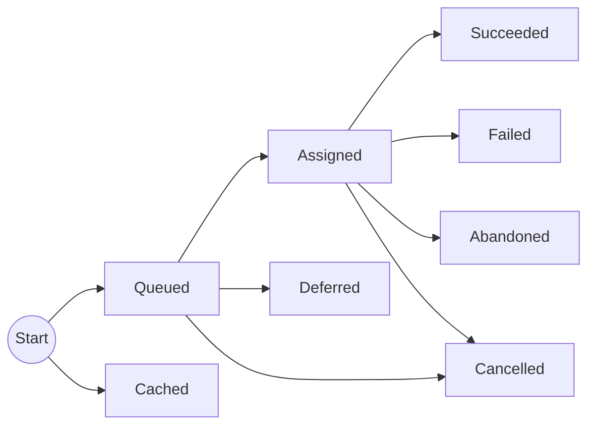

# Concepts

This page outlines the main concepts in Coflux.

## Projects

An instance of a Coflux _server_ may host multiple _projects_. Projects are further sub-divided into _environments_.

The expectation is that the same (or similar) workflows exist in each environment of a project. You might have environments for, e.g., 'production', 'staging', 'development/joe', etc. A shared server can be useful for referring colleagues to runs in specific projects/environments.

Projects (and environments) are relatively well isolated from each other - each have their own database and orchestrator process, though they are of course still sharing the same machine resources.

## Agents

An _agent_ is a process that hosts _repositories_. It connects to the server and is associated with a specific project and environment.

When the agent starts, it reports _manifests_ for the repositories that it's hosting, and then waits for commands from the server to execute specific tasks.

## Workflows

A _workflow_ is defined in a repository in code. A workflow is made up of a _tasks_ that are joined together by calling each other.

Workflows and tasks are collectively referred to as _targets_, although workflows are really just specical forms of tasks, which can be triggered to start a run. You can think of the distinction between workflows and tasks a bit like the distinction between public and private functions in a module.

## Runs

When a workflow is scheduled, this initiates a _run_. A run is made up of _steps_, which each correspond to a target. Each step has at least one associated _execution_. Steps can be retried (manually or automatically), which will lead to multiple executions being associated with the step.

## Execution states

The state transitions of an execution can be represented in a diagram: 

When an execution is first scheduled, it starts in the **queued** state unless it uses **cached** result. From the **queued** state it will transition to **assigned** once it is due, and a suitable agent is available to process it. At that point the agent will generally execute it until it's **succeeded** or **failed**. Executions may get **cancelled** either before or after they've been assigned. They may also be **deferred** if another execution superseeds it before it's assigned. If contact is lost with an agent for more than the timeout period, the task will be marked as **abandoned** (and we don't know whether it completed successfully).

If a step is automatically retired or manually re-run, an new execution starts from the beginning.
