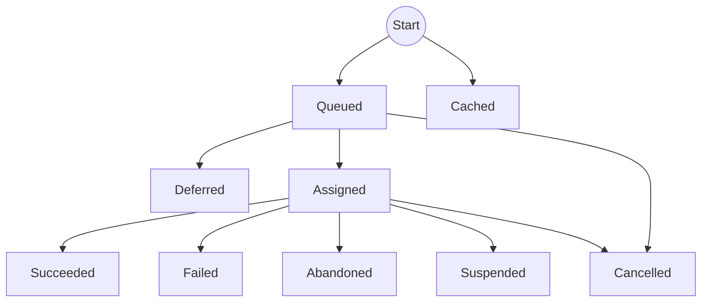

# Execution states

The state transitions of an execution can be represented in a diagram: 

When an execution is first scheduled, it starts in the _Queued_ state (unless caching is enabled and there is a cache hit, in which case it transitions straight to _Cached_).

From the _Queued_ state it will transition to _Assigned_ once it is due, and a suitable agent is available to run it, unless it become 'deferred' by another execution in the meantime.

Once assigned, the agent will generally execute it until it succeeds (_Succeeded_) or raises an exception (_Failed_). If contact is lost with an agent for more than the timeout period, the task that are running will be marked as _Abandoned_ (we don't know whether it completed successfully). Executions may be _Cancelled_ while they're running (or before they've been assigned). An execution may choose to suspend itself (either explicitly, or from timing out while waiting for another execution to complete) - in this case it will be automatically re-run.

Steps maybe be configured to automatically retry (from a failed or abandoned state), or they may be re-run manually, in which case a new execution will be started.
