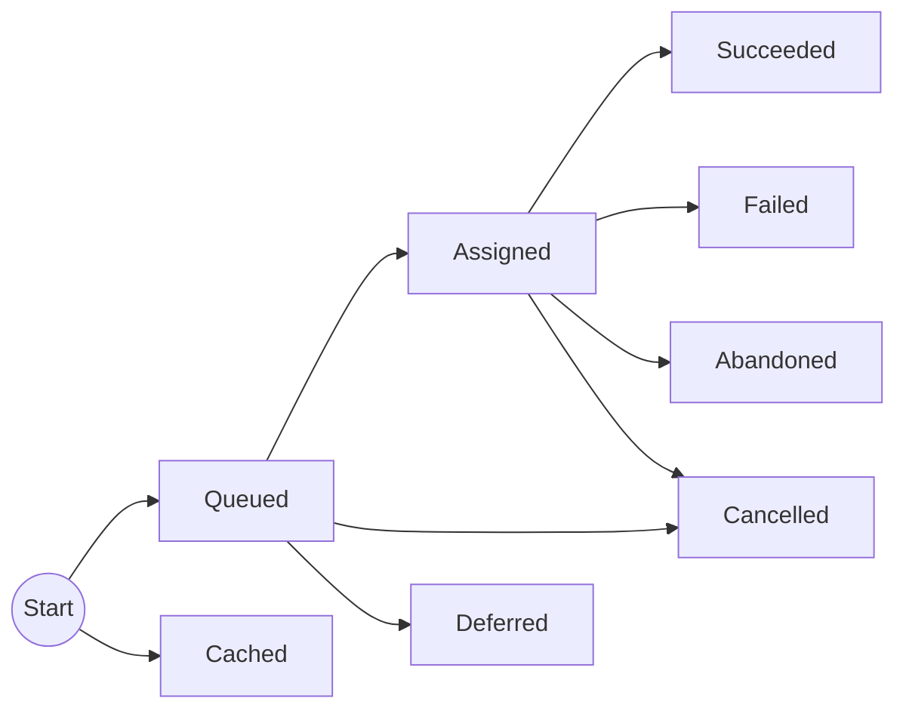

# Execution states

The state transitions of an execution can be represented in a diagram: 

When an execution is first scheduled, it starts in the _Queued_ state (unless caching is enabled and there is a cache hit, in which case it transitions straight to _Cached_). From the _Queued_ state it will transition to _Assigned_ once it is due, and a suitable agent is available to process it. At that point the agent will generally execute it until it's succeeds (_Succeeded_) or raises an exception (_Failed_). Executions may become _Cancelled_ either before or after they've been assigned. They may also become _Deferred_ if another execution superseeds it before it's assigned. If contact is lost with an agent for more than the timeout period, the task that are running will be marked as _Abandoned_ (and we don't know whether it completed successfully).

If an execution is automatically retired or manually re-run, a new execution starts from the beginning. An execution will only be retried from the _Failed_ or _Abandoned_ states.
