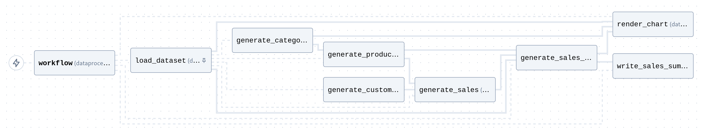
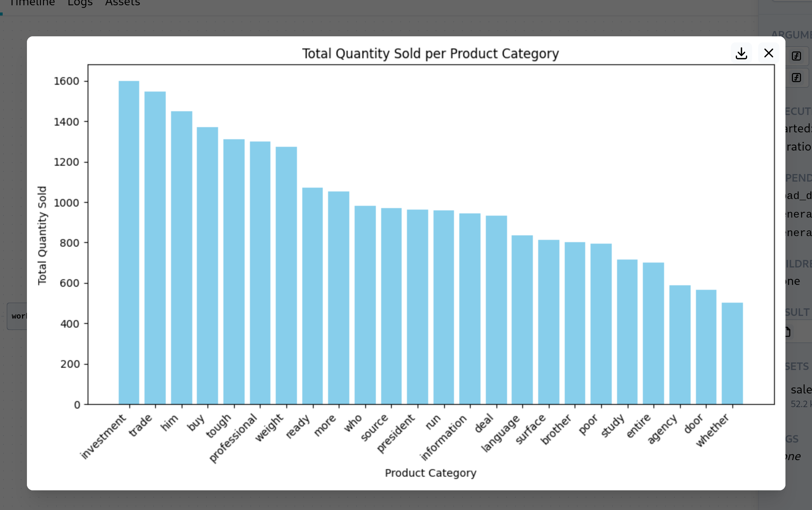

This example runs a basic ETL-like pipeline. A random dataset of customers/products/transactions is generated, this is then loaded into pandas, aggregated, and written to CSV.



This also renders a chart from the summary, which can be viewed in the web UI:



# Running

Build Docker image:

```bash
docker build -t coflux_pandasetl .
```

Run agent:

```bash
docker run --rm -t \
  --add-host host.docker.internal:host-gateway \
  -e COFLUX_HOST=host.docker.internal:7777 \
  -e COFLUX_PROJECT=... \
  coflux_pandasetl
```

Or with reload (allowing you to update the code without rebuilding/restarting):

```bash
  docker run ... -v "$(pwd):/app" coflux_pandasetl --reload
```
