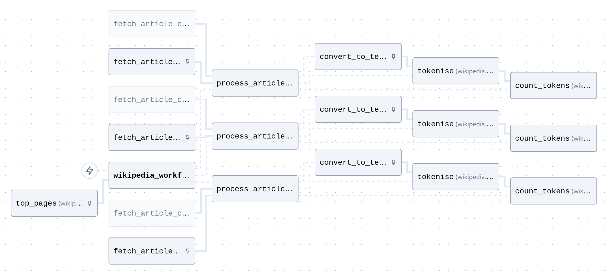

This example makes calls to the Wikipedia API to get the most viewed articles for the specified day and does some basic text operations on the pages (extracting text from HTML, tokenising, and counting tokens).



It makes use of caching/memoising, and shows how dependencies (e.g., the nltk model) can be bundled in a Docker file to simplify deployment.

# Running

Build Docker image:

```bash
docker build -t coflux_wikipedia .
```

Run agent:

```bash
docker run --rm -t \
  --add-host host.docker.internal:host-gateway \
  -e COFLUX_HOST=host.docker.internal:7777 \
  -e COFLUX_PROJECT=... \
  coflux_wikipedia
```

Or with reload (allowing you to update the code without rebuilding/restarting):

```bash
docker run ... -v "$(pwd):/app" coflux_wikipedia --reload
```
